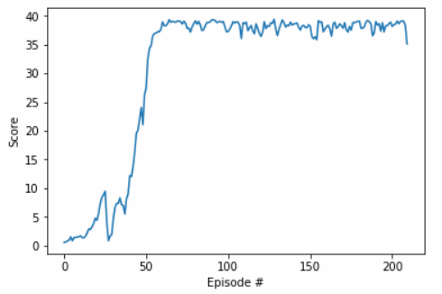

## Project 2 : Continuous Control (20 Agents version)

In this project, I tried to replicate what reportedly worked for the Udacity team on Attempt 4.

Here's what the Trained Agent Looks like:

#### Learning Algorithm : DDPG 

DDPG Description : 

- DQN cannot be directly applied to Continuous Action Spaces since discretizing the space into fine intervals can largely increase the computation cost for forward propagation of the Networks
- DDPG adopts DQN by utilizing a Actor-Critic Approach. The roles of each are as follows:
  - Actor : Approximate policy $\pi(s,a|\theta)$ $\to$ tune $\theta$
  - Critic : Evaluate the policy $\pi(s,a)$ as approximated by the actor by  approximating the Q=Value of the selected action. This approximation is done using the TD error Formula as :

$$
r_{t+1} = \gamma * (v^{\pi}(S_{t+1}) - v^{\pi}(S_{t}))
$$

- In order to aid exploration, OU Noise (As mentioned in the original paper) is added to each action selection
- Additionally, the following features are also used as mentioned in the original paper:
  - A replay buffer is utilized to store the experiences of the agents. For the 20 agents, a commong replay buffer is used
  - 2 separate networks are used for the action prediction and the expected values for Actor and critic both.
  - The Target Network is soft-updated on every iteration by a factor of $\tau$
  - A weight decay for the critic network is used
  - the action is not introduced until the second layer in the critic network for Q-value calculation
- Also, the udacity team's solution was used for the 20 agent environment
  - all agents add experience to a common replay buffer
  - every 20 time steps, the actor and critic networks are updated 10 times
- Below is the score progression for this assignment. The environment appears to be solved in about 70 iterations 

### Hyperparameters

| Hyperparameter          | Value |
| ----------------------- | ----- |
| $\gamma$                | 0.995 |
| $\tau$                  | 0.001 |
| Batch Size              | 512   |
| Buffer Size             | 1e5   |
| Critic weight decay     | 1e-6  |
| $\alpha_{actor}$        | 1e-4  |
| $\alpha_{critic}$       | 1e-3  |
| simulation time (t_max) | 1000  |

### Future Work:

- As mentioned in the project introduction, other algorithms for continuous space environments such as TRPO and DDDPG can be used. 
- The model of the actor and critic networks was directly picked up from the paper. Other network architectures should be investigated as well.