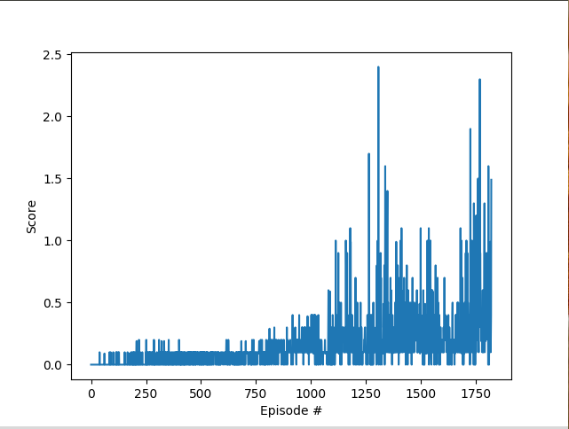
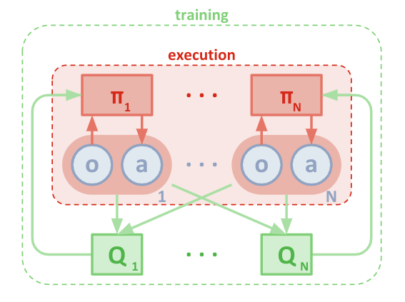

# Deep Reinforcement Learning Project -3

## Collaboration and Competition

Below image shows the final reward progression.

The Environment was solved in 1820 episodes

### Algorithm:

### 

In order to solve this environment, I implemented the Multi-DDPG algorithm. The features implemented are as :

- Each agent has separate Actors and critics

- Centralised training: Each agent's critic not only takes as input its own actor's actions and states, but also the states and actions of the all the other agents. Since only the actors are used during testing, and the actors only depend on the states of the corresponding actors, the agents are free to learn their own reward structures. The below image [source: https://arxiv.org/abs/1706.02275] shows the basic concept.

  

- Remaining details with respect to the DDPG algorithm remain more or less the same.

- The Hyperparameters, after tuning (thanks to the very helpful slack members for sharing their progress) where fixed to the following values:

  | Parameter                    | Value     |
  | ---------------------------- | --------- |
  | gamma                        | 0.99      |
  | tau                          | 0.2       |
  | Batch Size (Buffer)          | 1024      |
  | Buffer Size                  | 10^6      |
  | Weight Decay (Critic, Actor) | 0         |
  | Learning Rate : Actor        | $10^{-4}$ |
  | Learning Rate : Critic       | $10^{-3}$ |

- The Network Structure for both the Actor and Critic were chosen as:
  - 1st hidden layer : 256 units
  - 2nd hidden layer : 128 units
  - ELU activation was used for actor and ReLu for critic
- An interesting observation in this project is that the value of tau had a huge impact on the training stability unlike in the previous project

### Future Ideas

It would be interesting to implement Prioritized Experience Replay on this Algorithm. Further, other algorithms such as PPO can be tested for their performance in a multi-agent setting. Also, the above implementation can be extended to the much more complex soccer environment.